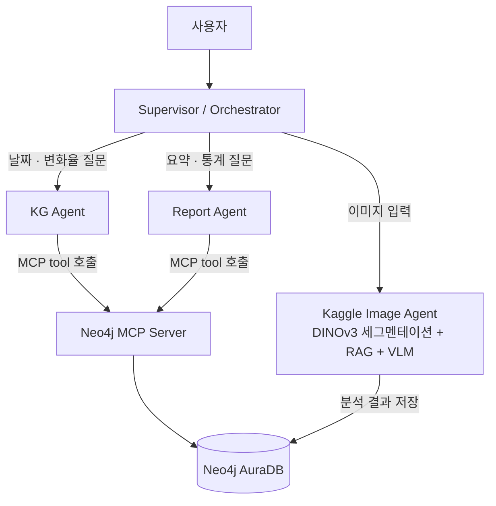

# Protein Synthesis Multi-Agent System

단백질 결정화(crystallization) 진행 상태를 이미지 기반으로 분석하고, 그 결과를 지식 그래프(Knowledge Graph)로 축적한 뒤 자연어로 질의/보고할 수 있는 멀티 에이전트 시스템입니다.

Supervisor(Orchestrator)가 질문을 분류해 이미지 분석 / KG 조회 / 보고서 생성 중 알맞은 에이전트로 라우팅하고, 각 에이전트는 A2A(Agent-to-Agent) 스타일의 HTTP 인터페이스와 MCP(Model Context Protocol)를 통해 Neo4j에 접근합니다.

## 아키텍처



- **Orchestrator (`orchestrator/`)**: Ollama(로컬 LLM)로 질문 의도를 분류해 세 에이전트 중 하나로 라우팅
- **KG Agent (`agents/kg_agent/`)**: 날짜·변화율·변화 속도 등 구체적인 KG 조회를 처리하는 FastAPI 서버 (포트 8001)
- **Report Agent (`agents/report_agent/`)**: 전체 통계/추세를 종합하는 리포트 생성 FastAPI 서버 (포트 8002)
- **Neo4j MCP Server (`mcp/`)**: FastMCP 기반으로 Neo4j Cypher 쿼리를 도구(tool)로 노출
- **Kaggle Image Agent (`image_agent.ipynb`)**: DINOv3 세그멘테이션 → RAG 기반 해석 → VLM(InternVL2.5) 리포트 생성 → Neo4j 저장까지 수행하는 GPU 파이프라인. 하드웨어 제약으로 로컬이 아닌 Kaggle 노트북에서 실행하고, ngrok으로 터널링해 로컬 Orchestrator와 연결합니다.

## 폴더 구조

```
ai_agent/
├── config.py                       # 공통 설정 (.env 로드)
├── import_to_neo4j.py              # kg_graph_JSON.json → Neo4j 최초 적재 스크립트
├── kg_graph_JSON.json              # KG 노드/엣지 원본 데이터
├── image_agent.ipynb               # Kaggle에서 실행하는 이미지 분석 파이프라인
├── orchestrator/
│   ├── main.py                     # CLI 진입점
│   ├── supervisor.py               # LLM 기반 라우팅
│   └── a2a_client.py               # A2A / Kaggle 호출 클라이언트
├── agents/
│   ├── kg_agent/kg_agent_server.py
│   └── report_agent/report_agent_server.py
└── mcp/
    └── neo4j_mcp_server.py         # Neo4j 조회 MCP 서버
```

## 시작하기

### 1. 환경 변수 설정

```bash
cp .env.example .env
```

`.env`에 아래 값을 채웁니다.

| 변수 | 설명 |
|---|---|
| `NEO4J_URI`, `NEO4J_USER`, `NEO4J_PASSWORD` | [Neo4j AuraDB](https://console.neo4j.io) 인스턴스 접속 정보 |
| `OLLAMA_URL`, `OLLAMA_MODEL` | 로컬 Ollama 라우팅 LLM (기본값: `llama3.1:8b`) |
| `KAGGLE_API_URL` | Kaggle 노트북(cell 30)이 ngrok으로 노출한 URL |
| `KAGGLE_API_KEY` | 로컬 ↔ Kaggle 간 요청 인증용 공유 비밀키 (임의의 랜덤 문자열, 아래 Kaggle Secrets와 동일해야 함) |
| `KG_AGENT_URL`, `REPORT_AGENT_URL`, `A2A_TIMEOUT` | 로컬 에이전트 서버 설정 |

### 2. Neo4j 초기 데이터 적재

```bash
pip install neo4j python-dotenv
python import_to_neo4j.py
```

### 3. 로컬 에이전트 서버 실행

```bash
python agents/kg_agent/kg_agent_server.py       # http://localhost:8001
python agents/report_agent/report_agent_server.py  # http://localhost:8002
```

### 4. Kaggle Image Agent 실행

1. `image_agent.ipynb`를 Kaggle에 업로드
2. 노트북 **Add-ons → Secrets**에 `HF_TOKEN`, `NEO4J_URI`, `NEO4J_USER`, `NEO4J_PASSWORD`, `NGROK_AUTHTOKEN`, `KAGGLE_API_KEY`(로컬 `.env`와 동일한 값) 등록
3. 전체 셀 실행 → 마지막에 출력되는 ngrok Public URL을 로컬 `.env`의 `KAGGLE_API_URL`에 반영

### 5. 실행

```bash
python orchestrator/main.py
```

## 보안 참고사항

- 모든 자격 증명은 `.env`(gitignore 처리됨)로 관리하며 코드에 하드코딩하지 않습니다.
- Kaggle 노트북이 노출하는 FastAPI 엔드포인트(`/analyze`, `/search_kg`, `/report`, `/rag_search`)는 `X-API-Key` 헤더 검증을 거칩니다.

## 트러블슈팅

프로젝트 점검 과정에서 발견/수정한 이슈는 [TROUBLESHOOTING.md](./TROUBLESHOOTING.md)에 정리되어 있습니다.

## 기여

커밋 메시지 컨벤션 등은 [CONTRIBUTING.md](./CONTRIBUTING.md)를 참고하세요.
